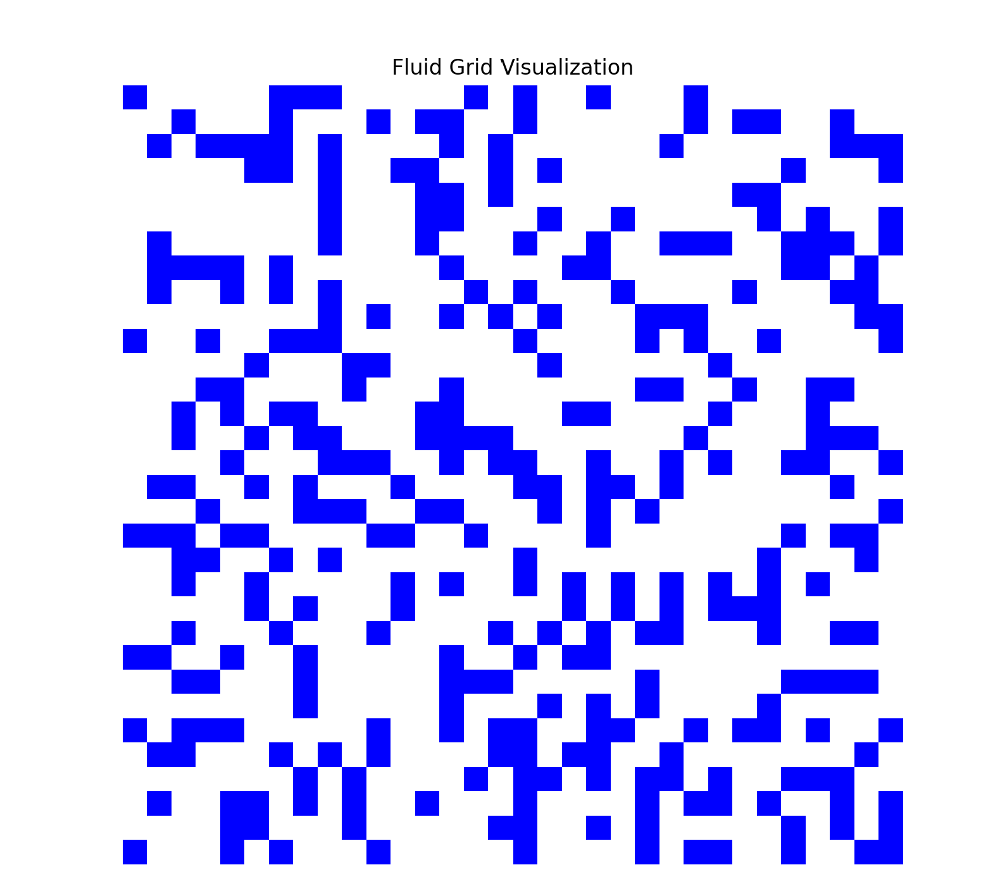
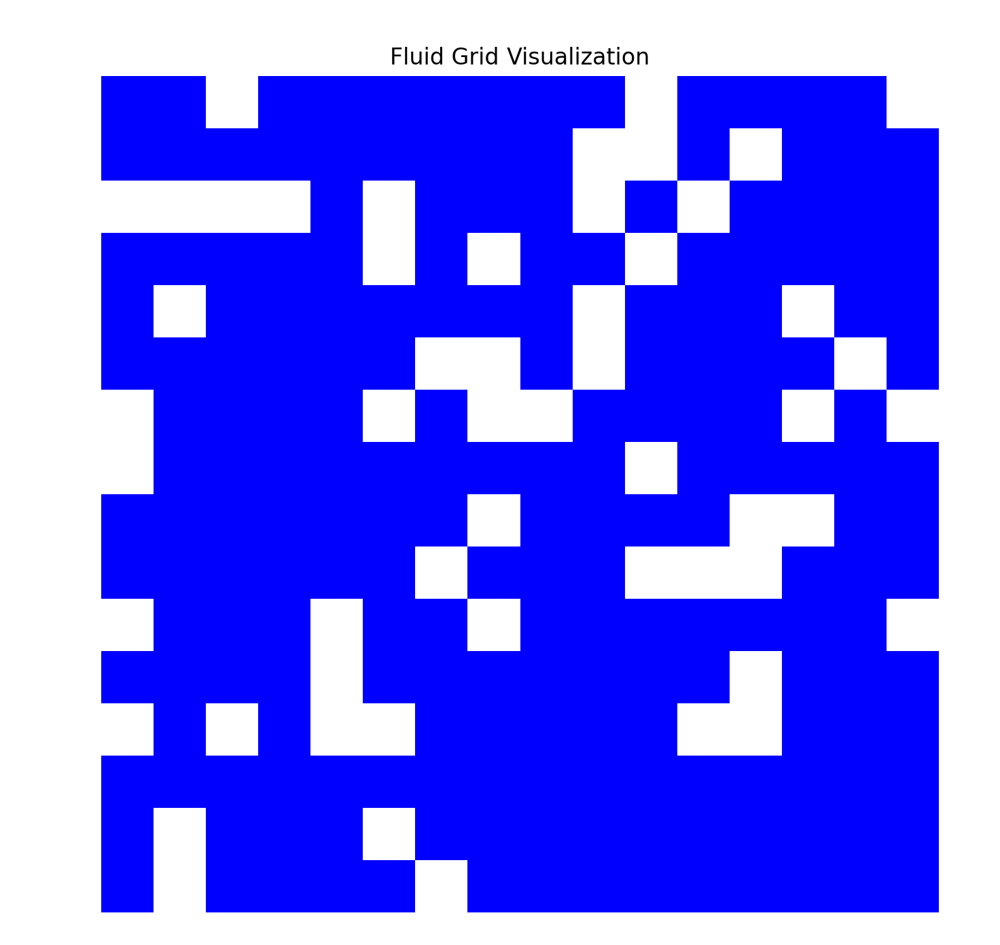

> Posted on 2024-04-03

#### Project Members:

- Xuanye Chen
- Zhenzhe Li
- Ruijie Jian
- Huasen Xi

#### Project Summary:

As part of our final project, we aim to integrate an efficient Multigrid-preconditioned Conjugate Gradient (MGPCG) method into our GPU-based fluid simulation system. This algorithm is crucial for solving the projection Poisson equation efficiently, which is a central component of maintaining the incompressibility of the fluid in our simulation.

### MGPCG Algorithm Implementation:

#### Current Progress:

1. **Initial Research and Planning (Completed)**

   - **Date:** Week 1 of Project Timeline
   - Activities:
     - Conducted a comprehensive review of the literature on MGPCG algorithms and their application in fluid dynamics.
     - Defined the algorithm's role within the context of our fluid simulation framework.
   - Outcome:
     - Established a clear understanding of the algorithm's mathematical foundation and its relevance to our project goals.
     - Developed an initial algorithmic flowchart and integration strategy with the fluid simulation pipeline.

2. **Development of MGPCG Algorithm Prototype (In Progress)**

   - **Date:** Week 2 of Project Timeline

   - Activities:

     - Started coding the basic structure of the MGPCG algorithm in Python for conceptual testing.
     - Integrated simple test cases to validate the correctness of the prototype.

   - Current Status:

     - We have successfully implemented the grid discretization for the Poisson equation and developed functions for coarsening the grid as part of our approach to solve the equation. Additionally, several sub-functions including iterative processes and smoothers have been completed. However, we are still encountering issues with solving the overall equation programmatically, which is our current focus to resolve.

      

     

     after downsample:

      

     

   - Challenges Encountered:

     - Despite the progress in developing the necessary components of the MGPCG algorithm, there are still reservations about the efficiency and stability of the convergence of the algorithm. Ensuring the high performance and reliable convergence of the algorithm remains a significant challenge, which we are actively working to address. We anticipate resolving these issues shortly, but the concerns about algorithmic efficiency and stability are ongoing.

3. **GPU Integration and Optimization (Upcoming)**

   - **Planned Start Date:** Week 3 of Project Timeline
   - Planned Activities:
     - Port the MGPCG algorithm from Python to CUDA to leverage GPU acceleration.
     - Integrate the MGPCG algorithm with the main fluid simulation pipeline.
     - Conduct extensive testing to ensure the algorithm works efficiently within the GPU-based simulation environment.
   - Expected Challenges:
     - Ensuring the stability and efficiency of the MGPCG algorithm under GPU architecture.
     - Managing data transfer and synchronization overheads on GPU.

4. **Performance Evaluation and Final Adjustments (Upcoming)**

   - **Planned Start Date:** Week 4 of Project Timeline
   - Planned Activities:
     - Compare the performance of the GPU-based MGPCG algorithm against the CPU-based version.
     - Fine-tune the algorithm to address any performance bottlenecks.
     - Finalize the integration and prepare for project presentation.
   - Goals:
     - Achieve significant performance improvements over the CPU-based method.
     - Ensure that the algorithm maintains the physical correctness of the fluid simulation results.

#### Next Steps:

- Complete the initial GPU porting of the MGPCG algorithm.
- Begin comprehensive integration testing with the fluid simulation system.
- Start detailed performance analysis to identify and resolve any inefficiencies.

### Conclusion

The development and integration of the MGPCG algorithm are critical for enhancing the performance of our GPU-accelerated fluid simulation system. Achieving this milestone will not only demonstrate the technical capabilities of our team but also significantly advance the state of our final project.

This milestone documentation should provide a clear and structured record of the MGPCG algorithm's implementation phases within our project. This will assist in tracking progress, evaluating performance, and ensuring successful completion of the integration.

